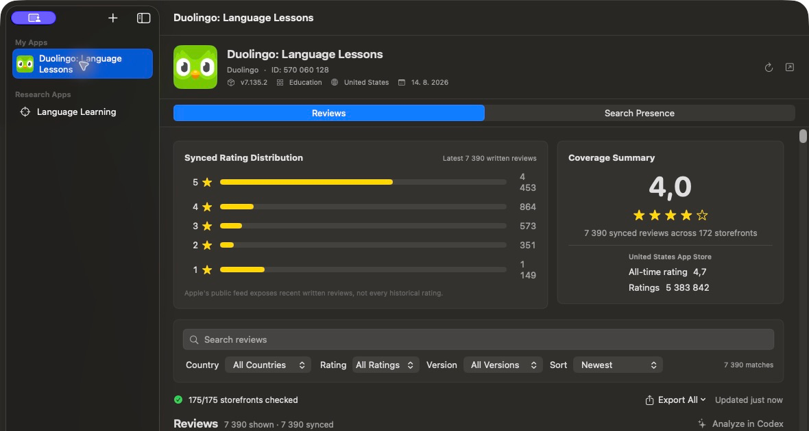
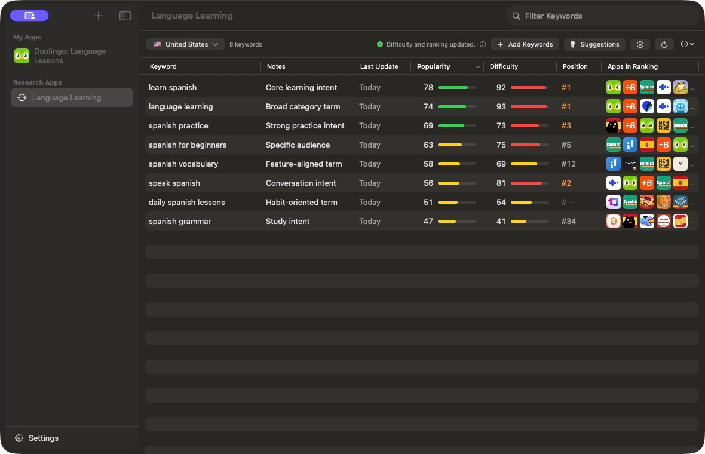
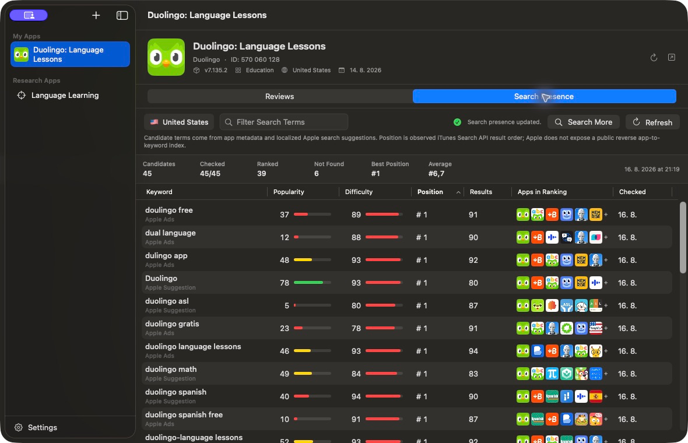

# ReadRevs

ReadRevs is a native SwiftUI macOS application for App Store review analysis,
keyword discovery, popularity research, and observed search presence.

It keeps review research and App Store optimization work in one local workspace.
The project is independent, open source under MIT, and contains no campaign
mutation calls or project-operated backend.

## Screenshots

### Reviews



### Keyword Research



### Search Presence



## Features

- Search for App Store apps by name, ID, or URL and keep a local app library.
- Sync recent public written reviews across 175 App Store storefronts.
- Filter and export reviews as JSON or spreadsheet-safe CSV.
- Track keywords by storefront with popularity, estimated difficulty, observed
  result position, and apps appearing in the results.
- Discover related terms from Apple Ads and Apple-hosted search suggestions.
- Inspect an app's search presence from metadata-derived and suggested candidate
  terms.
- Optionally analyze a read-only local review export with an installed Codex CLI.

## Metric Definitions

- **Popularity** is Apple's 1-100 search popularity when Apple Ads returns an
  exact value. A dash means no exact value was available for that term, country,
  genre, week, or connected account.
- **Difficulty** is a local competition estimate based on rating volume in public
  App Store search results. It is not an Apple Ads metric.
- **Position** is the app's observed order in the public iTunes Search API response
  for the queried term. It is not a guaranteed organic App Store rank.
- **Search presence** tests a finite candidate set assembled from app metadata and
  localized suggestions. Apple does not expose a public reverse app-to-keyword
  index, so the result is not an exhaustive list of every ranking term.

## Data Sources and Limits

- Apple Ads Platform API v1 provides account access, keyword suggestions, and
  search-term popularity for connected, eligible accounts.
- Apple Search Ads API v5 app search is used only to find eligible apps owned by
  the connected organization.
- Apple's public iTunes Search and Lookup APIs provide app metadata and observed
  search-result order.
- Apple's legacy customer-review RSS feed provides recent written reviews. The app
  currently checks the first page per storefront, up to 50 reviews where Apple
  makes them available.
- The Apple-hosted `MZSearchHints` endpoint supplies best-effort localized search
  suggestions. It is undocumented and may change or stop working without notice.

The application contains no campaign create, update, or delete calls. Apple API
availability, account eligibility, rate limits, and returned coverage remain under
Apple's control.

## Requirements

- macOS 14 or newer
- Xcode 26 / Swift 6.2 or newer
- Optional: an Apple Ads account with API Read Only access and an eligible app
- Optional: Codex CLI installed and signed in for review analysis

## Build and Test

```sh
swift test --disable-sandbox --scratch-path /private/tmp/readrevs-tests
./Scripts/build-app.sh debug
```

The debug application is written to `build/ReadRevs Debug.app`.

Create a Universal 2 release bundle, ZIP, local dSYM, and checksum:

```sh
./Scripts/package-app.sh
```

Without a Developer ID identity this command applies an ad-hoc signature suitable
for local testing. See [RELEASING.md](RELEASING.md) before publishing binaries.

## Apple Ads Setup

1. In Apple Ads, grant the API user `API Account Read Only` or limited `API Read
   Only` access.
2. Open ReadRevs > Settings > Apple Ads and generate a key pair.
3. Add the displayed public key in Apple Ads Account Settings > API.
4. Enter the Client ID, Team ID, and Key ID returned by Apple, then connect.
5. Select a read-only ad account and an eligible Research App.

The private key and identifiers are stored in this Mac's Keychain with
device-only protection. The app never asks for or stores an Apple ID password.

## Local Data

The library, synced research data, and optional Codex history are stored under
`~/Library/Application Support/ReadRevs`. Apple Ads credentials are stored in
Keychain. The app contains no analytics or telemetry. See [PRIVACY.md](PRIVACY.md).

On first launch, ReadRevs merges saved apps, Codex preferences, and completed
Codex research history from older ReadRevs and pre-release `ASO Research` data.
Current ReadRevs records win on conflicts, and source data is left intact.

## Contributing

See [CONTRIBUTING.md](CONTRIBUTING.md) for the development workflow and
[SECURITY.md](SECURITY.md) for private vulnerability reporting.

## License

ReadRevs is available under the [MIT License](LICENSE).

## Acknowledgements

- The original review-reading product idea behind ReadRevs comes from
  [Filip Kowalski](https://filippkowalski.com), creator of ReadReviews.dev.
- The focused keyword-research workflow and information design were inspired by
  [Astro](https://tryastro.app).

ReadRevs is an independent implementation. No code or proprietary data from those
products is included in this repository.

ReadRevs is an independent project and is not affiliated with or endorsed by
Apple Inc. Apple, App Store, Apple Ads, and macOS are trademarks of Apple Inc.
